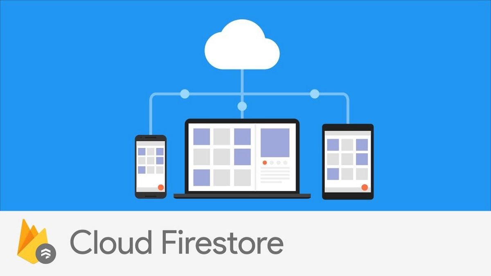

# CNAM-ProjetC1-2018

Sujet: **Firebase Cloud Firestore**

 - [Introduction au Cloud Firestore de Google Firebase](#Introduction-au-Cloud-Firestore-de-Google-Firebase)
 - [Concept et spécifications du Cloud Firestore](#concept-et-sp-cifications-du-cloud-firestore)
 - [Différence entre Cloud Firestore et Realtime Database](#diff-rence-entre-cloud-firestore-et-realtime-database)
 - [Code Exemple (Implémentation sur Android)](#code-exemple-impl-mentation-sur-android-)
 - [App Exemple](#App-Exemple)

*Projet préparé par **Youssef Kassouf** (8464F)*

*Source d’informations: *
https://firebase.google.com/docs/firestore


<br />
<hr />
<br />

## Introduction au Cloud Firestore de Google Firebase

Firebase Cloud FireStore est une base de données Cloud, NoSQL, flexible, et évolutive pour stocker et synchroniser des données pour le développement côté client et côté serveur. C'est est une base de données de Firebase et Google Cloud Platform, pour le développement mobile, web et serveur.

Comme "Firebase Realtime Database", il synchronise les données entre les applications des client via des écouteurs en temps réel (realtime listeners) et offre du "Offline Support" pour mobile et Web, afin de développer des applications qui fonctionnent indépendamment de la latence du réseau ou de la connectivité Internet.

Cloud FireStore est une base de données NoSQL, de documents, conçue pour "l'Automatic Scaling", la haute performance et la facilité de développement d'applications. Alors que l'interface Cloud FireStore possède plusieurs des mêmes fonctionnalités que les bases de données traditionnelles, comme une base de données NoSQL, elle diffère de celles-ci dans la façon dont elle décrit les relations entre les objets de données.

<br />
<hr />
<br />

## Concept et spécifications du Cloud Firestore

Cloud Firestore est une base de données sur le cloud, et qui les applications iOS, Android et Web peuvent accéder directement via leurs SDK natifs. Cloud Firestore est aussi disponible dans les SDK Node.js, Java, Python, REST et RPC APIs.

- **Data model: **
Suivant le modèle de données NoSQL de Cloud Firestore, les données sont stockées dans des documents contenant des champs correspondant aux valeurs, et ces documents sont aussi stockés dans des collections. Les documents peuvent contenir de nombreux types de données, depuis les chaînes de caractères et les nombres jusqu'aux objets complexes. Les documents pouvent aussi contenir des sous-collections.
<br><br>
- **Flexibility: **
Le modèle de données Cloud Firestore prend en charge des structures de données hiérarchiques flexibles. Les données sont stockées dans des documents, organisés en collections. Les documents peuvent contenir des objets imbriqués complexes en plus des sous-collections.
<br><br>
- **Expressive querying: **
Les requêtes peuvent être utilisées pour récupérer des documents spécifiques ou pour récupérer tous les documents d'une collection correspondants aux paramètres des requêtes.
Les résultats peuvent êtres triés, filtrés et limités.
Les requêtes sont aussi indexées par défaut, de sorte que leurs performances sont proportionnelles à la taille de résultats et non à l'ensemble de données.
<br><br>
- **Realtime updates: **
Comme "Realtime Database", Cloud Firestore utilise la synchronisation des données pour mettre à jour les données sur tout appareil connecté. Cependant, il est également conçu pour rendre les requêtes d'extraction simples et efficaces.
Des écouteurs en temps réel (realtime listeners) peuvent êtres ajoutés pour conserver les données de l'application à jour, sans récupérer la base de données entière chaque fois qu'une mise à jour se produit.
<br><br>
- **Offline support: **
Cloud Firestore met en cache les données que l'application utilise activement, afin que l'application puisse écouter, écrire, et lire des données même si l'appareil n'est pas connecté. Lorsque l'appareil se reconnect, Cloud Firestore synchronise toutes les modifications locales vers le cloud.
<br><br>
- **Designed to scale: **
Cloud Firestore apporte le meilleur de la puissante infrastructure de Google Cloud Platform: la réplication automatique de données multi-régions, la fortes garanties de cohérence, les opérations par lots atomiques, et le support des transactions réelles.
<br><br>
- **Security: **
L'accès aux données dans Cloud Firestore peut être protégé avec "Firebase Authentication" et les règles de sécurité du Cloud Firestore pour Android, iOS et JavaScript, ou avec Identity and Access Management (IAM) pour les langues côté serveur.


<br />
<hr />
<br />


## Différence entre Cloud Firestore et Realtime Database

|  | Realtime Database | Cloud Firestore |
| :---- | :------------- | :----- |
| **Data model** | Stocke les données sous forme d'un grand arbre JSON. | Stocke des données dans des documents organisés dans des collections. |
| **Querying** | Requêtes complexes avec des fonctionnalités de tri et de filtrage limitées. | Requêtes indexées avec tri et filtrage. |
| **Scalability** | L'évolutivité nécessite une répartition. | L'évolutivité est automatique. |
| **Security** | Règles en cascade qui nécessitent une validation séparée. | Sécurité plus simple et plus puissante pour les SDK mobiles, Web et serveurs. |

<br />
<hr />
<br />


## Code Exemple (Implémentation sur Android)

 1. **Installation**:
	 - Ajouter le Cloud Firestore library au app/build.gradle file:

    ``` json
    compile 'com.google.firebase:firebase-firestore:11.8.0'
    ```

 2. **Initialisation**

    ``` java
    FirebaseFirestore db = FirebaseFirestore.getInstance(); 
    ```

 3. **Ecriture de données**
	- Ecriture de données à une nouvelle 'Collection' et 'Document' dans Cloud Firestore
	
	``` java
	Map<String, Object> dataToSave = new HashMap<>();
	dataToSave.put("message", "Hello World!");
	db.collection("Messages").add(dataToSave); 
	```
	- Ecriture de données à une 'Collection' et 'Document' existants
	
	``` java
	DocumentReference documentReference = FirebaseFirestore.getInstance().document("Messages/SharedMessage");
	//'Messages' est le nom du Collection et 'SharedMessage' est le nom du Document dans Cloud Firestore
	Map<String, Object> dataToSave = new HashMap<>();
	dataToSave.put("message", "Hello World!");
	documentReference.set(dataToSave); 
	```
	- Des Listeners peuvent être ajoutés pour déclencher un événement en cas de succès ou d'échec de l'écriture de données
	
	``` java
	DocumentReference documentReference = FirebaseFirestore.getInstance().document("Messages/SharedMessage");
	Map<String, Object> dataToSave = new HashMap<>();
	dataToSave.put("message", "Hello World!");
	documentReference.set(dataToSave).addOnSuccessListener(new OnSuccessListener<Void>() {
            @Override
            public void onSuccess(Void aVoid) {
                Toast.makeText(getApplicationContext(), "Message successfully saved!", Toast.LENGTH_SHORT).show();
            }
        }).addOnFailureListener(new OnFailureListener() {
            @Override
            public void onFailure(@NonNull Exception e) {
                Toast.makeText(getApplicationContext(), "Error: Message was not saved!", Toast.LENGTH_LONG).show();
            }
        }); 
	```

 4. **Lecture de données**
``` java
	documentReference.addSnapshotListener(new EventListener<DocumentSnapshot>() {
            @Override
            public void onEvent(DocumentSnapshot documentSnapshot, FirebaseFirestoreException e) {
                if (documentSnapshot.exists()) {
                    String message = documentSnapshot.getString("message");
                }
            }
        });
	```

<br />
<hr />
<br />


## App Exemple

[Android App exemple (.apk)](app-exemple.apk)


